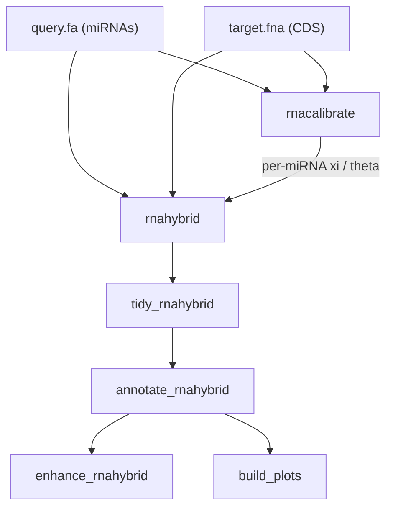

# Novum Pipeline

A Snakemake workflow that runs RNAhybrid on miRNA queries against bacterial coding sequences — optionally calibrated per-miRNA via RNAcalibrate — then tidies, annotates, enhances, and (optionally) plots the results.

## Workflow



1. **rnacalibrate** *(optional)* — fits an extreme-value distribution to randomized targets and emits one (xi, theta) pair **per query miRNA**.
2. **rnahybrid** — runs RNAhybrid in parallel via GNU Parallel; in calibrated mode, each (miRNA, target chunk) pair invokes RNAhybrid with that miRNA's own (xi, theta).
3. **tidy_rnahybrid** — filters, selects, and arranges the raw output into a tidy CSV.
4. **annotate_rnahybrid** — parses FASTA headers from the target genome and merges metadata onto the tidy rows.
5. **enhance_rnahybrid** — appends human-readable alignment visualizations.
6. **build_plots** *(optional)* — renders configurable ggplot2 PDFs from the annotated tables. Skipped entirely when `build_plots.type` is unset.

## Dependencies

Commands assume a Linux bash shell on Debian/Ubuntu.

### GNU Parallel

```bash
sudo apt update && sudo apt install -y parallel
```

### Conda

```bash
wget https://repo.anaconda.com/miniconda/Miniconda3-latest-Linux-x86_64.sh
bash Miniconda3-latest-Linux-x86_64.sh
source ~/miniconda3/bin/activate
conda config --add channels defaults
conda config --add channels bioconda
conda config --add channels conda-forge
conda config --set channel_priority strict
```

Recommended channel order (bioconda is built on top of conda-forge, so conda-forge must have higher priority to avoid ABI mismatches):

```text
conda-forge
bioconda
defaults
```

### RNAhybrid

```bash
conda install bioconda::rnahybrid
```

### Snakemake

```bash
conda create -n snakemake-modern python=3.11 snakemake-minimal
conda activate snakemake-modern
```

## Run

```bash
snakemake --use-conda --cores N
```

To re-render only the plots after editing the `build_plots` block:

```bash
snakemake --use-conda --cores N --forcerun build_plots
```

## Configuration

Edit [`Config/config.yaml`](Config/config.yaml). Example:

```yaml
queries:
  escherichia_coli: Data/Raw/validated_miRNAs.fa
targets:
  escherichia_coli: Data/Raw/GCF_000005845.2_ASM584v2_cds_from_genomic_escherichia_coli.fna

rnacalibrate:
  mode: both                  # "calibrated" | "uncalibrated" | "both"
  k: 10000
  max_target_length: 50000
  randomize_targets: true

rnahybrid:
  threads: 16
  species: 3utr_human
  hits: null
  u: null
  v: null
  energy: -18
  pvalue: null
  seed: null
  distribution: null          # ignored when calibrated; falls back to "species" otherwise

tidy_rnahybrid: {}
annotate_rnahybrid: {}

build_plots:                  # optional; omit the whole block to skip plotting
  type: all                   # pvalue_distribution | position_pvalue | position_energy | all
  basesize: 12
  pvalue: 0.01                # cutoff for position_pvalue and position_energy
  locus:
    - b3704                   # bare: any miRNA hitting this locus
    - b2063,hsa-miR-1226-5p   # paired: only this miRNA × this locus
  gene:
    - yegH,hsa-miR-1226-5p
    - rnpA,hsa-miR-4747-3p
  protein:
    # - "30S ribosomal protein S2,hsa-miR-X"

results_dir: Data/Results/
```

### Queries and targets

`queries:` and `targets:` are paired by key — each key names one (query, target) sample run, and the two mappings must use identical keys. The legacy single `query: <path>` form is still accepted: when `queries:` is absent, the same FASTA is broadcast against every entry in `targets:`.

### Calibration mode

`rnacalibrate.mode` selects which variant(s) the pipeline produces in a single invocation:

- **`calibrated`** — runs `rnacalibrate` first and feeds its per-miRNA (xi, theta) into `rnahybrid`. Outputs land under `{results_dir}/{sample}/w_calibration/`.
- **`uncalibrated`** — skips `rnacalibrate`; `rnahybrid` falls back to `rnahybrid.distribution`, or to its built-in `species` default if unset. Outputs land under `{results_dir}/{sample}/wo_calibration/`.
- **`both`** — produces both trees in one run for side-by-side comparison.

When calibration runs, the artifact at `{results_dir}/{sample}/w_calibration/rnacalibrate.json` contains one (xi, theta) row per miRNA in the query FASTA. RNAhybrid is then invoked once per (miRNA, target chunk) pair with that miRNA's own parameters, so every row's p-value reflects its own null model rather than a population mean. The static `rnahybrid.distribution` value is ignored whenever calibration runs.

`rnacalibrate.randomize_targets` maps to RNAcalibrate's `-s` flag and should usually stay `false` unless you have confirmed it produces valid fits for your inputs.

> **Deprecated:** `rnacalibrate.enabled: true|false` is still honored when `mode` is absent (`true` → `calibrated`, `false` → `uncalibrated`), but new configs should use `mode`. Support will be removed in a future release.

### Plots

The `build_plots` block is opt-in: omit it (or remove `type:`) and no plot job is scheduled, no R env is materialized.

- **`type`** — which panels to render: `pvalue_distribution`, `position_pvalue`, `position_energy`, `all`, or any comma-separated subset (e.g. `"pvalue_distribution,position_pvalue"`). Panels appear in the order listed.
- **`basesize`** — ggplot2 base font size.
- **`pvalue`** — cutoff applied to the scatter points in `position_pvalue` and `position_energy` (the density plot ignores it).
- **`locus`**, **`gene`**, **`protein`** — lists of validated hits to highlight. Each entry is either:
    - **bare** — `<target>` matches any miRNA hitting that target;
    - **paired** — `<target>,<miRNA>` matches only when the row's miRNA equals the named one.

  Bare and paired entries can mix freely in the same list. YAML strings with spaces or punctuation (typical for `protein_name`) must be quoted: `"30S ribosomal protein S2,hsa-miR-X"`. The `protein:` block is optional and requires a `protein_name` column in the annotated CSV.

The `pvalue_distribution` panel draws one dashed vertical line per validated entity (lowest p-value per `(miRNA, locus_tag)`); `position_pvalue` and `position_energy` plot every alignment of the matched pairs, all keyed to the same color and shape in a shared legend.

The output filename bakes the `type` value in (commas become hyphens), so cycling through types in the same `results_dir` doesn't overwrite earlier PDFs. When `rnacalibrate.mode: both`, panels are faceted by calibration variant; with one variant, the facet collapses automatically.

## Outputs

One tree per `targets:` key, under `{results_dir}/{sample}/`:

```text
{sample}/
├── w_calibration/                  # mode = "calibrated" or "both"
│   ├── rnacalibrate.json
│   ├── rnahybrid_output.tsv
│   ├── tidy_output.csv
│   ├── rnahybrid_annotated.csv
│   └── rnahybrid_enhanced.txt
├── wo_calibration/                 # mode = "uncalibrated" or "both"
│   ├── rnahybrid_output.tsv
│   ├── tidy_output.csv
│   ├── rnahybrid_annotated.csv
│   └── rnahybrid_enhanced.txt
└── plots_<type>.pdf                # only when build_plots.type is set
```

## Citation

If you use this workflow in a publication, please cite this repository and the external tools it relies on:

- **RNAhybrid**: Kruger, J. and Rehmsmeier, M. (2006). RNAhybrid: microRNA target prediction easy, fast and flexible. *Nucleic Acids Research*, 34(Web Server issue), W451--W454. https://doi.org/10.1093/nar/gkl243
- **GNU Parallel**: Tange, O. (2023, November 22). GNU Parallel 20231122 ('Grindavik'). Zenodo. https://doi.org/10.5281/zenodo.10199085
